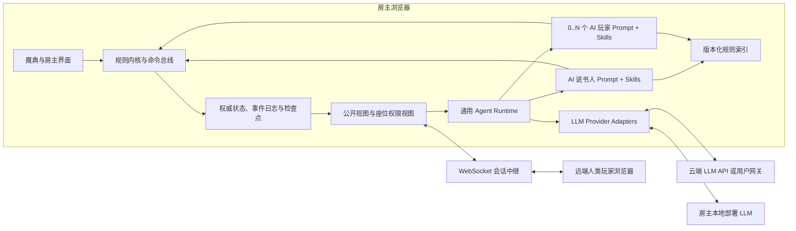

# BotC-AI 目标架构

## 架构目标

目标架构同时满足四个条件：严格执行可验证规则、把全部 Agent 编排留在房主浏览器、复用 townsquare 在线能力、支持多个 LLM 供应商与任意人机席位组合。

核心分层为“确定性规则内核、权限视图、统一动作协议、浏览器 Agent Runtime”。AI 不能绕开这些层直接修改魔典。

## 系统边界

“Agent 运行在房主浏览器”指 Agent 循环、上下文、Skills、工具权限、记忆和调度均在该浏览器执行。云端或本地 LLM 端点只完成推理，不成为对局状态的权威方。

## 领域状态与事件

权威状态至少包含：

- 对局身份：规则版本、剧本、随机种子、房间与阶段。
- 座位：控制者类型、玩家身份、真实角色、认知角色、阵营、存活、死亡票和席位连接状态。
- 效果：醉酒、中毒、保护、提名/投票修正、提醒标记、持续时间和来源。
- 流程：首夜/其他夜行动队列、白天计时、提名、投票、处决、胜负检查和待裁量任务。
- 通信：公开、阵营、点对点、玩家到说书人的消息元数据及投递状态。
- Agent：Prompt/Skill/模型版本、运行状态、预算和私有记忆引用；密钥不属于领域状态。

所有变更由命令触发，并产生可重放事件。典型链路为：

1. 人类 UI 或 Agent Skill 提交命令。
2. 权限层确认提交者能否执行该动作。
3. 规则内核依据当前状态和规则版本校验前置条件。
4. 需要裁量时，内核生成范围受限的裁量任务；AI 说书人只能从合法候选中选择或提供指定结构的结果。
5. 内核提交领域事件，归约器更新状态。
6. 视图层为不同接收者生成最小信息事件或快照。
7. UI、在线同步、Agent 观察与审计日志消费各自允许看到的结果。

## 权限视图

状态不能先完整广播再由客户端隐藏。房主在发送或构造 Agent 上下文前生成接收者视图：

- `StorytellerView`：完整真相、全部规则任务和系统审计，不默认包含模型密钥原文。
- `SeatView(seatId)`：该席位认知角色、收到的私密信息、自己的动作历史、公开信息和当前合法动作。
- `PublicView`：座位名、公开死亡、公开发言、提名投票和规则允许公开的状态。
- `ObserverView`：由房主策略从公开视图进一步裁剪。

AI 玩家即使与说书人运行在同一进程，也只能获得 `SeatView`。上下文构建函数不得接受完整状态后依靠 Prompt 约束模型“不要看”。

## 规则内核

规则内核负责确定性部分：

- 开局人数与角色类型比例、设置修正和合法剧本校验。
- 阶段状态机、首夜/其他夜顺序和待行动者。
- 存活、死亡、处决、复活、醉酒、中毒和角色/阵营变化。
- 提名资格、投票资格、死亡票、计票、旅行者流放和处决限制。
- 持续效果的建立、暂停、终止和来源追踪。
- 通用及可确定的角色特殊胜负条件。
- 命令权限、幂等、状态不变量和事件重放。

对于信息真假、模糊注册、角色能力开放式选择和官方规则明确交给说书人判断的情况，规则内核生成结构化裁量任务。任务应包含规则依据、合法候选、禁止项和预期结果结构，避免让 LLM 自由发明状态变更。

## Agent Runtime 与 Skills

Runtime 面向说书人和玩家提供同一生命周期：

1. 从权限视图与新事件形成观察。
2. 选择与当前阶段匹配的系统提示词和 Skills。
3. 按预算调用 Provider，解析结构化回复或工具调用。
4. 校验 Skill 和工具权限，提交领域命令或通信命令。
5. 把结果、错误和规则拒绝反馈给 Agent，直到完成、超时或等待外部输入。

Skill 是可版本化、可测试的能力包，至少包含说明、允许工具、输入输出约束、示例和适用阶段。系统提示词负责身份、目标、风格与总体策略，不承载会频繁更新的全部规则正文。

每个 Agent 运行实例具有独立的：

- 消息历史与摘要
- 私有笔记命名空间
- 模型和预算配置
- 任务队列与取消信号
- 工具能力集合
- 审计 ID 与用量统计

## LLM Provider 适配

核心接口屏蔽供应商差异，并标准化：

- 消息与多模态输入的能力声明
- 普通和流式生成
- 原生工具调用或结构化输出降级
- AbortSignal 取消、超时、限流重试和退避
- 上下文窗口、Token 预算、费用与缓存命中
- 鉴权、CORS、网络和供应商错误分类

OpenAI、Claude、DeepSeek、火山方舟和 OpenAI 兼容本地模型分别实现 Adapter。供应商不支持原生工具调用时，可以由统一结构化协议降级，但必须经过同样的工具校验。

密钥存储与对局持久化分离。默认不把密钥写入 localStorage；如产品允许设备保存，应使用明确授权和浏览器安全存储方案，并提供一键清除。

## 在线会话

当前 townsquare WebSocket 服务是消息中继，房主是会话权威。重构后在线协议应区分：

- 权限过滤后的状态快照和领域事件
- 公开/私密通信
- 玩家动作请求与房主确认结果
- 心跳、能力协商、版本和重连游标

AI 玩家不建立远端 WebSocket 连接，而是通过房主浏览器内的本地传输实现同一客户端协议。这样可以复用动作、消息和重连语义，同时避免模拟多个网络客户端。

当前开发边界已经移除源码中的隐式公共中继：开发页面默认只连接 `127.0.0.1` 上的本地中继，生产构建必须显式配置受控地址，缺少或配置非法时关闭在线会话。该配置边界只防止开发误连外部生产服务，不替代后续的协议版本、权限过滤、隐私和正式部署设计。

协议消息必须具有版本、消息 ID、对局 ID、发送者、目标和幂等键。服务端只能看到完成中继所需的数据；端到端私密消息是否加密需在独立需求中澄清并设计。

## 规则知识流水线

规则同步是开发/构建工具，不在对局中实时抓取网页。流水线包含：

1. 根据受控入口和允许域名发现页面。
2. 使用 HTML 解析器定位正文与元数据，不使用难以维护的整页正则。
3. 清洗脚本、导航和无关展示，保留标题、列表、表格、图片与内部引用。
4. 规范化 URL、文件名和角色 ID，检测重定向与重复内容。
5. 输出 Markdown/结构化规则、来源清单、内容哈希和抓取报告。
6. 切分、索引并生成浏览器可加载的版本化知识包。
7. 以固定页面样本进行解析回归，以规则查询样本验证召回与引用。

主要来源为集石运营维护的《染·钟楼谜团》中文官方资料站 `clocktower-wiki.gstonegames.com`。中文资料缺失时使用 `wiki.bloodontheclocktower.com` 等英文官方资料补充；补充内容需要翻译为中文，并在来源清单中同时记录英文页面修订、内容哈希、中文翻译版本和复核状态。中英文资料发生语义冲突时无条件采用中文官方结论，英文差异仅进入同步报告。集石中文官方魔典用于核对中文术语、界面信息架构和交互，不作为确定性规则正文的唯一来源。相邻实验项目的 Wiki 抓取逻辑只作为页面分类与清洗需求的参考，不直接复制实现。

## 持久化与恢复

浏览器本地保存内容分为：

- 可恢复对局检查点与事件日志
- 房主设置和无敏感模型配置
- 每个 AI 玩家隔离的私有笔记
- 规则知识包与索引缓存
- 可选的 Agent 审计与用量数据

数据结构必须版本化并提供迁移。恢复对局时先验证事件链、规则版本和状态不变量；无法安全恢复则以只读方式导出诊断，不猜测修复隐藏状态。

## 测试架构

当前基础设施使用 Jest、Vue Test Utils v1 和 Vue CLI 转换链承载单元、Vue 组件、场景与本地中继集成测试，使用 Playwright Chromium 承载浏览器端到端测试。Node.js 22、锁文件安装、分层 npm 脚本和 GitHub Actions 组成一致门禁；测试启动只监听回环地址的本地中继并阻断外部网络，不把公共会话、真实 LLM 或生产数据作为依赖。初始源码不设置全仓覆盖率阈值，后续新模块在各自需求中定义有效覆盖和模块级门禁。

- 纯函数单元测试：规则、命令校验、归约器、视图过滤、知识清洗。
- 场景测试：使用给定初态和命令序列断言事件与最终状态，规则来源写入用例元数据。
- 属性测试：随机合法命令序列下验证状态不变量和重放一致性。
- Provider 契约测试：以假服务验证流式、取消、工具、限流和错误映射。
- Agent 测试：确定性假模型输出固定工具调用，验证权限、循环和失败恢复。
- 在线集成测试：房主、多个远端人类客户端和本地 AI 客户端使用相同协议。
- 浏览器端到端：完整昼夜、提名投票、断线恢复、人工接管和复盘。

## 演进约束

- townsquare 初始源码固定且不再主动同步，不补建全量旧行为基线；新增边界先写测试，修改遗留行为时为受影响范围增加回归。
- AI 能力通过新边界接入，不在 Vue 组件中直接调用模型。
- 每次只迁移一个可验收的垂直切片，保持魔典可构建、可运行。
- 训练与自博弈复用生产规则内核和事件格式，但运行在独立模拟入口，不能引入只为训练存在的规则捷径。
